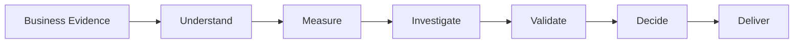

<div align="center">

# 🔍 BizLens

### AI-Assisted Business Analysis Workspace

**What changed → Where to investigate → What needs validation → What action can be taken**


</div>

BizLens is a Streamlit application that connects **business data, documents, investigation, recommendations, and professional BA deliverables** in one workspace.

Instead of stopping at *"what happened?"*, BizLens helps you move from a quantified change to an investigation, a validated finding, and a deliverable you can hand to stakeholders.

---

## 📑 Table of Contents

- [Why BizLens?](#-why-bizlens)
- [Screenshots](#-screenshots)
- [How It Works](#-how-it-works)
- [Key Features](#-key-features)
- [Core Principles](#-core-principles)
- [BA Deliverables](#-ba-deliverables)
- [Tech Stack](#-tech-stack)
- [Project Structure](#-project-structure)
- [Getting Started](#-getting-started)
- [Optional AI Configuration](#-optional-ai-configuration)
- [Working With Your Data](#-working-with-your-data)
- [Data Quality](#-data-quality)
- [Testing](#-testing)
- [Project Status](#-project-status)
- [Author](#-author)

---

## 💡 Why BizLens?

Business analysis usually means working across many sources at once:

- Sales and operational data
- Requirements documents
- Meeting notes
- Management reviews
- Customer or support information
- KPI reports

BizLens brings these sources into **one connected workflow**, so analysis, investigation, recommendations, and deliverables all work from the **same business evidence**.

---

## 🎥 Demo

[▶️ Watch the BizLens Demo](<video src="./demo.mp4" controls width="100%" https://github.com/priyankakaryampudi/Bizlens-Ai-Insights-Workspace/blob/main/BizLens_compressed.mp4></video>)

---

## 🖼️ Screenshots

### Workspace


### Data & Insights


### Investigation


---

## ⚙️ How It Works



The workflow follows a practical Business Analysis approach:

> **Business problem → Quantified change → Investigation → Validation → Business impact → Action → Deliverable**

### Example from the demo workspace

The built-in demo connects one sales dataset with five supporting documents. From that evidence, BizLens surfaces a chain like this:

1. **Quantified change:** revenue declined 1.6% from Q3 to Q4.
2. **Where to look:** the South region is the focus and declined in the aligned comparison.
3. **Signal to validate:** SLA performance in South fell from 82.5% to 71.8%, and support-ticket pressure rose.
4. **What is *not* claimed yet:** the service issue is treated as a strong signal, not a confirmed root cause.
5. **Action:** a recommendation with an owner, a success measure, and the evidence behind it.

---

## ✨ Key Features

### 📂 Evidence Workspace
Connect business datasets and supporting documents in one workspace.

**Supported formats:** `CSV` · `XLSX` · `XLS` · `DOCX` · `PDF` · `PPTX` · `TXT`

### 📊 Data & Insights
- KPI analysis
- Trend analysis
- Business dimension analysis
- Interactive visualizations
- Data profiling
- Data quality checks
- Downloadable dashboard (HTML)

### 📋 Business Context
Organizes the material that shapes the solution:
- Requirements
- Business evidence
- Decisions
- Open questions
- Stakeholder context

### 🔎 Investigation
Explore:
- Where changes are concentrated
- Possible contributing signals
- Operational patterns
- Areas requiring further validation

### ✅ Recommendations
Turns findings into an actionable path containing:
- Supporting evidence
- Proposed action
- Owner
- Success measure
- Validation requirements

### 💬 Ask BizLens
Ask questions about the connected workspace in natural language.

*Example questions:*
- Why did revenue change?
- Which region requires attention?
- What are the key business requirements?
- What information still needs validation?

### 🧾 Deliverables Studio
Generate structured Business Analysis deliverables from the connected workspace, with a preview before you download.

---

## 🧭 Core Principles

| Principle | What it means |
|---|---|
| **Evidence before assumptions** | Observed evidence is kept separate from assumptions and hypotheses. |
| **Analysis before conclusions** | Business patterns are identified before recommendations are generated. |
| **Validation before root cause** | A contributing signal is not automatically treated as a confirmed root cause. |
| **No silent data changes** | Potential data quality issues are surfaced instead of silently changing the source data. |
| **Traceability** | Requirements and findings can be carried through into downstream BA deliverables. |

---

## 📦 BA Deliverables

BizLens supports a structured pack of **18 deliverables**:

| # | Deliverable | # | Deliverable |
|:-:|---|:-:|---|
| 01 | Executive Brief | 10 | Business Case |
| 02 | Business Requirements Document (BRD) | 11 | Requirements Traceability Matrix (RTM) |
| 03 | Product Requirements Document (PRD) | 12 | Implementation Roadmap |
| 04 | Functional Requirements Document (FRD) | 13 | User Stories |
| 05 | AS-IS / TO-BE Process Specification | 14 | Use Cases |
| 06 | Root Cause Analysis (RCA) | 15 | UAT Scenarios |
| 07 | Data & Business Analysis Report | 16 | Stakeholder Analysis |
| 08 | KPI Performance Review | 17 | RACI Matrix |
| 09 | Gap Analysis | 18 | Action Plan |

---

## 🛠️ Tech Stack

| Area | Technology |
|---|---|
| Application | Streamlit |
| Language | Python |
| Data analysis | Pandas, NumPy |
| Visualization | Plotly |
| Spreadsheet processing | OpenPyXL, XLRD |
| Document parsing | python-docx, pypdf, pdfplumber, python-pptx |
| Report generation | ReportLab, python-docx |
| Diagrams | Graphviz |
| Optional AI | Google Gemini, OpenAI |
| Configuration | python-dotenv |

---

## 🗂️ Project Structure

```text
BizLens/
│
├── app.py                     # Entry point and navigation
├── run_bizlens.bat            # Windows launcher
├── run_tests.py               # Full test suite
├── requirements.txt
├── VERSION.txt
├── TESTING_GUIDE.md
├── .env.example
│
├── screenshots/
│   ├── home.png
│   ├── data-insights.png
│   └── investigation.png
│
├── pages/
│   ├── home.py                # Home
│   ├── 1_Ask.py               # Ask BizLens
│   ├── 2_Data.py              # Data & Insights
│   ├── 3_Investigation.py     # Investigation
│   ├── 5_Documents.py         # Business Context
│   ├── 6_Recommendations.py   # Recommendations
│   └── 7_Deliverables.py      # Deliverables Studio
│
├── src/
│   ├── ingest.py
│   ├── doc_intel.py
│   ├── analytics.py
│   ├── intelligence.py
│   ├── workspace.py
│   ├── evidence.py
│   ├── recommendations.py
│   ├── process_intel.py
│   ├── reports.py
│   ├── ai.py
│   ├── state.py
│   ├── styles.py
│   └── ui.py
│
├── data/
├── test_data/
├── tests/
└── deliverables/
```

---

## 🚀 Getting Started

### Requirements

- Python **3.13**
- Windows with VS Code recommended

### 1. Clone the repository

```powershell
git clone https://github.com/<your-username>/BizLens.git
cd BizLens
```

### 2. Create and activate a virtual environment

```powershell
py -3.13 -m venv .venv
.\.venv\Scripts\Activate.ps1
```

### 3. Install dependencies

```powershell
python -m pip install -r requirements.txt
```

### 4. Run BizLens

```powershell
python -m streamlit run app.py
```

Or use the Windows launcher:

```powershell
run_bizlens.bat
```

Once it opens, either **upload your own business evidence** or click **Try the complete demo workspace** on the Home page.

---

## 🤖 Optional AI Configuration

BizLens runs **without an AI API key**. Core calculations, profiling, charts, data quality checks, and structured analysis are all handled locally. AI is optional and is used only for natural-language synthesis.

### Gemini

Create a `.env` file in the project root:

```env
GEMINI_API_KEY=your_api_key_here
```

### OpenAI

```powershell
$env:OPENAI_API_KEY="your-api-key"
```

You can also paste a key into the **AI connection** area of the sidebar. It is kept for the current session only.

> ⚠️ **Never commit real API keys to the repository.** Keep your `.env` file out of Git.

---

## 📁 Working With Your Data

- Upload structured datasets and supporting business documents through the app.
- Multiple datasets can be connected, with one **active dataset** selected for analysis.
- Connected evidence stays available across every stage of the workflow.

---

## 🧹 Data Quality

BizLens identifies potential:

- Missing values
- Duplicate records
- Inconsistent fields
- Potential outliers
- Other data quality issues

The source data is **not silently modified**. Any imputation, deletion, or treatment should be reviewed against the business context.

---

## 🧪 Testing

Run the basic validation:

```powershell
python -m compileall -q .
python tests\smoke_test.py
```

Run the complete test suite:

```powershell
python run_tests.py
```

---

## 📌 Project Status

**Version:** 4.5.0

BizLens is a **portfolio project** demonstrating how business evidence can be connected to structured analysis, investigation, recommendations, and professional Business Analysis documentation.

---

## 👤 Author

**Priyanka Karyampudi**

🔗 [GitHub Repository](https://github.com/<your-username>/BizLens)

---

<div align="center">

*Evidence before assumptions. Analysis before conclusions. Validation before action.*

</div>
